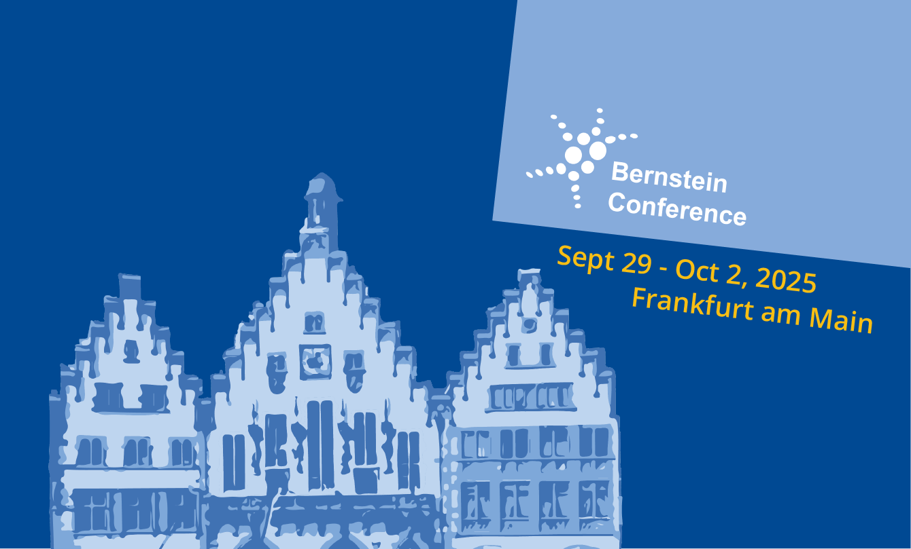

I am excited to share that, together with Irina Pochinok from the "Hamburg faction" of the lab, I will co-organise two events at the Bernstein Conference 2025 in Frankfurt.

Both events are centered around [CON2PHYS](https://gin.g-node.org/mchini/CON2PHYS), a collaborative study on 
CONceptual CONsistency in electroPHYSiology, 
a project that is near and dear to my heart. CON2PHYS is an attempt at quantifying whether when "we" electrophysiologists 
refer to a high-level concept (dimensionality, functional communication, but also hippocampal ripple, or spike-spike correlations etc.), 
we actually mean the same thing and come to same quantitative conclusions. The project takes a very practical approach to try to answer this question.
We have curated a blinded high-quality electrophysiological dataset of mice carrying out a behavioral task, 
which we will use to ask very simple multiple-choice questions to the participants. Will we see consensus above chance-level across the board? 
Only for certain concepts? Time will tell.

Does this sound interesting to you? Do you want to know more or participate in the study? You're still on time to do it! The project 
will launch around the Bernstein Conference, participation will be open to everyone, and submissions will be accepted for ~9-12 months.
All details are available [here](https://gin.g-node.org/mchini/CON2PHYS)

### PhD Symposium – 28 September 2025
The ["Consensus" PhD symposium](https://bernstein-network.de/en/bernstein-conference/early-career-scientists/phd-symposium/) 
will open the conference on September 28th. 
Irina and I will co-organize a hackathon, in which we will divide PhD students in small teams, and have them tackle a few questions taken from
[CON2PHYS](https://gin.g-node.org/mchini/CON2PHYS). Next, we will quantify the extent to which the teams will have reached a "Consensus",
and discuss the results with all participants.

### Satellite Workshop – 29–30 September 2025
Next, Irina and I, together with Simon Musall, will host a Satellite Workshop on September 29th-30th:
[Same words, different worlds: Conceptual consistency in systems neuroscience](https://bernstein-network.de/bernstein-conference/program/satellite-workshops/consistency/)
The workshops brings together a stellar cast of philosophers, experimentalists, theorists, and engineers. Together with them, we will explore the (lack of) 
conceptual consistency in system neuroscience across very different domains: spike sorting, definition of ripples and other types of oscillatory phenomena,
neural timescales, causality measures, neural manifolds and many more.

If you are attending the conference and want to talk to me/us because you are interested in these topics or in one of the available 
[postdoc opportunities](/opportunities/postdoc-ad/), feel free to reach out via e-mail or on socials, see details [here](/team/).

