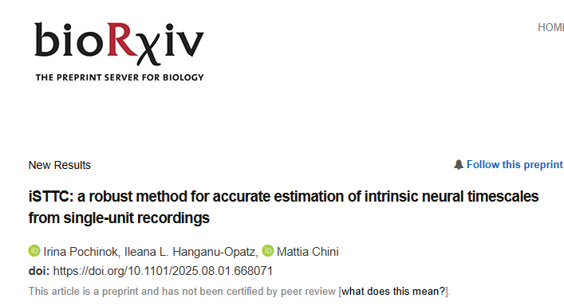

We are very happy to share our latest [preprint](https://www.biorxiv.org/content/10.1101/2025.08.01.668071v1) introducing iSTTC, 
a powerful new tool for accurately measuring intrinsic neural timescales from single-unit activity datasets. 
This work was spearheaded by Irina Pochinok, a PhD student in Hamburg, in the institute of Ileana Hanganu-Opatz.

Intrinsic neural timescales reflect how neural networks integrate information over time. They vary widely within the brain, 
and they are thought of representing the characteristic temporal dynamic at which a brain area tends to operate; 
neural timescales are short in brain areas that are specialized in rapid sensory reactions, and longer in those that are devoted to complex decision-making. 
I find neural timescales fascinating, because I see them as a promising tool to link low-level mechanisms (single-neuron or circuit level properties) to 
cognitive and behavioral phenomena. In that sense, I think that a fascinating property is that many findings about timescales are remarkably robust;
the have been replicated across wildly different species (from worms and flies to humans) and recording modalities (from single-unit activity to fMRI).

However, current approaches to estimate timescales from single-unit activity are unstable, especially when the single-unit data is sparse or segmented 
into short trials. Our new method, iSTTC, overcomes these issues, providing reliable estimates even from sparse or epoched data. 
It significantly improves accuracy and allows inclusion of many more neurons in analyses, which makes the estimated timescale more representative 
of the underlying neural circuit.

Something unexpected but important emerged while benchmarking iSTTC: we discovered that the common practice of estimating neural timescales from short, 
epoched data is very unreliable. Such estimations lead to errors approximately ten times larger than those from long, uninterrupted recordings. 
This wasn't our original goal, but it's a significant finding that we think will be of interest to the timescales community at large. 
In our [manuscript](https://www.biorxiv.org/content/10.1101/2025.08.01.668071v1), 
we provide practical advice on the types of data needed for reliable and robust intrinsic timescale estimation.

This [preprint](https://www.biorxiv.org/content/10.1101/2025.08.01.668071v1) is only the beginning of our lab's deeper exploration into neural timescales, 
particularly during brain development, where sparse data is the norm. 
We developed iSTTC specifically for these challenging developmental datasets. We look forward to sharing insights 
from our upcoming developmental studies and uncovering new principles about how neural timescales shape cognitive development.

