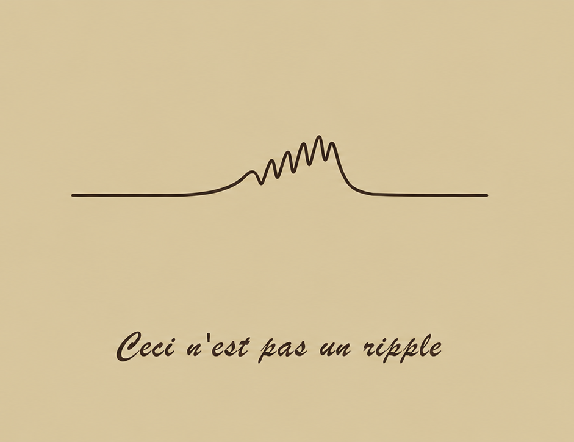

Together with Gaëlle Chapuis, I have written a piece for [The Transmitter](https://www.thetransmitter.org/reproducibility/eighteen-teams-analyzed-the-same-neurophysiology-dataset-and-got-wildly-different-answers/) 
about [CON²PHYS](https://mchini.github.io/con2phys/) (CONceptual CONsistency in electroPHYSiology), a project of the lab.

The story starts with ripples. At a hackathon we organized, 18 teams analyzed the same Neuropixels dataset to find which brain area showed the most hippocampal ripples. Their estimates ranged from almost none to ten per minute. Every team was skilled and every method was defensible, yet a ripple turned out to be whatever each detection pipeline decided it was. Magritte would have understood.

If electrophysiology cannot agree on something as concrete as a ripple, what else might we be getting wrong? That is the question CON²PHYS sets out to answer.

[Read the full piece on The Transmitter.](https://www.thetransmitter.org/reproducibility/eighteen-teams-analyzed-the-same-neurophysiology-dataset-and-got-wildly-different-answers/)

[Get involved with the full-scale CON²PHYS project](https://mchini.github.io/con2phys/)

