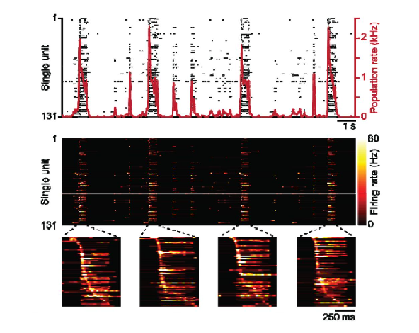

I am over the moon to share that our work on preconfigured neuronal firing sequences in human brain organoids has just been published in Nature Neuroscience:
[Preconfigured neuronal firing sequences in human brain organoids](https://www.nature.com/articles/s41593-025-02111-0)

This project was led by Tjitse van der Molen, Alex Spaeth and Tal Sharf, together with an impressive range of collaborators 
spanning UCSC, UCSB, ETH Zürich, Johns Hopkins, Hamburg (ourselves!) and others. 
My own contribution focused mostly on the analysis of large-scale electrophysiology recordings, statistical modelling, and on shaping the final story; 
the heavy lifting in terms of experiments, data generation and infrastructure is very much theirs.

The central question is simple: when do structured firing sequences appear in the developing brain, and do they depend on sensory experience? 
To tackle this, we analysed single-unit activity from four systems:
- human iPSC-derived brain organoids from two independent labs
- mouse ESC-derived cortical organoids with dorsal forebrain identity
- ex vivo neonatal mouse somatosensory cortex slices
- dissociated 2D mouse primary cortical cultures

Using high-density CMOS-based MEAs, we found that human and mouse organoids, as well as neonatal cortical slices, 
naturally generate “proto” firing sequences during spontaneous population bursts. A minority of neurons forms a backbone: 
high-firing units that fire in a precise order on ~10² ms timescales, burst after burst. 
These backbone neurons sit in the tail of lognormal firing rate and connectivity distributions, and occupy a low-dimensional subspace of the population activity.
This low-dimensional activity pattern is what constitutes the stable part of the firing sequences that we observed.
Around them, a larger pool of more irregular, flexible units explores higher-dimensional dynamics.

Crucially, 2D dissociated cultures do not show these stable sequences. They still burst, but their activity collapses into more 
lower-dimensional patterns that cannot sustain ordered sequences. This contrast points to something quite concrete: 
the emergence of temporal sequences is not just a generic property of any spiking network, but depends on 3D cytoarchitecture 
and self-organized developmental programs.

Putting this together, the main message is: even in a closed system with no sensory input, developing 3D brain tissue self-organizes into 
networks that generate structured firing “proto-sequences”. This provides strong support for the preconfigured brain hypothesis: 
early circuits already contain temporal scaffolds that later experience can refine, rather than building everything from scratch.

For me, this paper is also an important proof-of-principle for what large-scale electrophysiology in brain organoids can tell us about human circuit development. 
It shows that organoids can reveal deep, conserved principles of network organization when recorded and analysed at the right scale. 
And it reinforces my conviction that we are only scratching the surface of what organoid electrophysiology can do, both for basic developmental 
neuroscience and for future precision psychiatry.