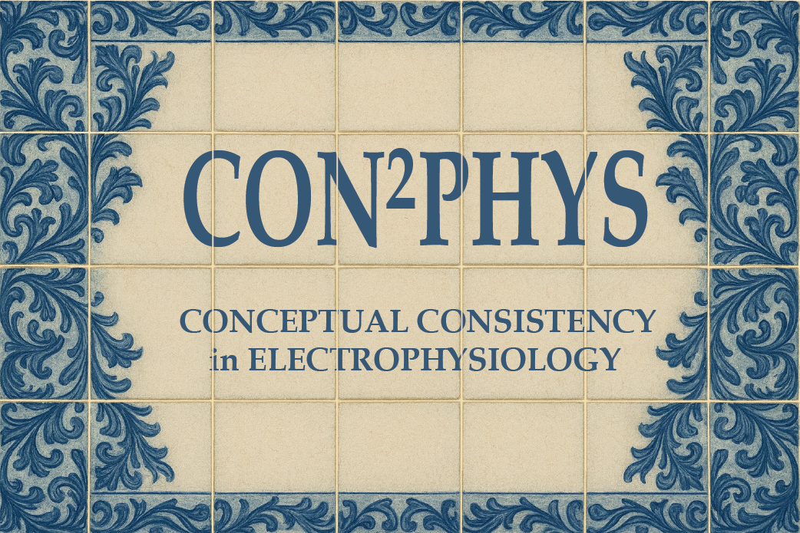
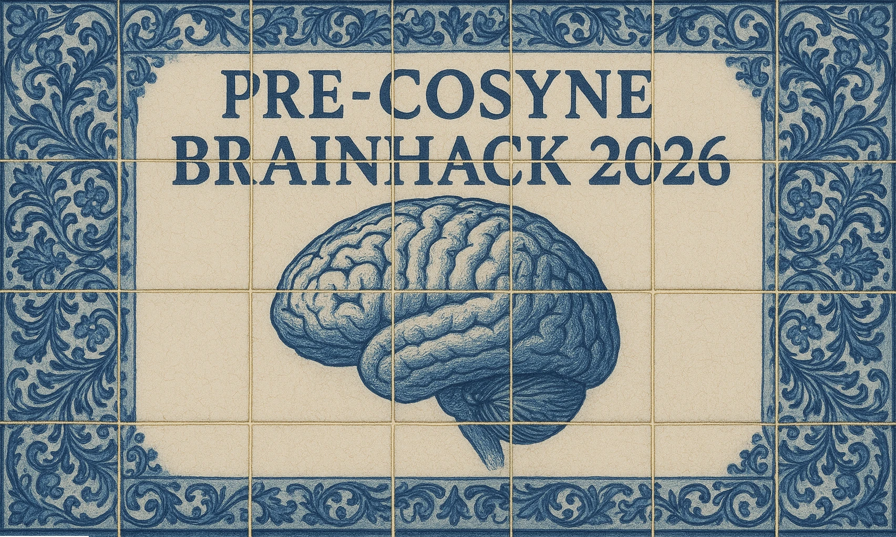

[CON²PHYS](https://mchini.github.io/con2phys/) is now officially launched, and the full project is **ready for submissions**!

And the good news don't finish here. 
In March, we will also run a dedicated CON²PHYS hackathon around COSYNE, co-organized with 
the **International Brain Laboratory (IBL) software engineers** and **Irina Pochinok** (from the Hamburg faction of the lab).

# What CON²PHYS is (in one sentence)
One blinded in vivo ephys dataset, one deliberately underspecified multiple-choice questionnaire, and a simple goal: 
measure how much (or how little) consensus exists when neuroscientists operationalize “standard” systems-neuroscience concepts.
For all the project details, how to participate, and much more, please see the [project website](https://mchini.github.io/con2phys/).

# The hackathon
The pre-COSYNE Brainhack details are [live](https://pre-cosyne-brainhack.github.io/hackathon2026/).

Format-wise, it’s the same spirit as the [Bernstein CON²PHYS hackathon](https://www.chinilab.com/news/25-07-30-bernstein-2025/), but 
the event will be longer. It will unfold across two days, and it will feature talks from Research Software Engineers on how to improve consistency. 
Here is the [schedule](https://pre-cosyne-brainhack.github.io/hackathon2026/schedule/). Another key difference is that most questions will be 
different from those of the Bernstein hackathon.

A few concrete points:
- You will work on **4 questions** (out of the 15 in the full CON²PHYS questionnaire). 
- The dataset is the same CON²PHYS dataset (single-unit + LFP, 18 mice, 3 brain areas, anonymized task details).
- The point is not to “get the right answer”. The goal is to analyze whether our implementations of the same concepts lead to different results,
and to discuss these sources of variability.

### Prize for the most creative application
Yes, we’re doing a small prize for the **most creative hackathon application**. 
The details available after you [register](https://pre-cosyne-brainhack.github.io/hackathon2026/registration/) for the hackathon 👀.

# Full CON²PHYS submission
And if you’re gutted you can’t make it to the hackathon, don’t overthink it. Skip straight to the next step and start 
working on the [full project](https://mchini.github.io/con2phys/). Remember that substantive submissions will be eligible for **co-authorship**.  

Important! Participating in the hackathon does not affect your eligibility to submit a full CON²PHYS analysis.

See you in Lisbon/Cascais.

