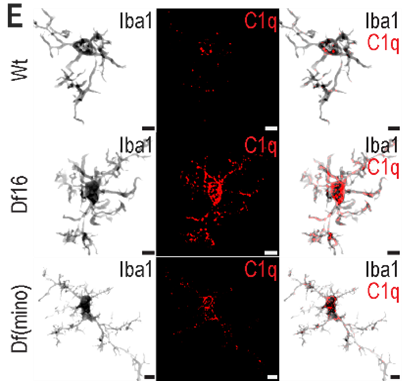

I am excited to share that we just published a study from my time in the Hanganu-Opatz lab in Hamburg: 
“Early rebalancing of neuroinflammatory cascades lastingly rescues prefrontal deficits in a 22q11.2ds model”. 
This project was led by Anne Günther, who did the bulk of the work and drove the study end-to-end. 

The starting point is a clinically motivated one: 22q11.2 deletion syndrome is one of the strongest known genetic risk factors for psychiatric disease, 
but the developmental mechanisms that drive the pathophysiology remain unclear. 
Using the Df(16)A mouse model, we focused on superficial prefrontal layers (L2/3), a neuronal population with prolonged maturation and high vulnerability
to disease (e.g., [Chini et al., 2020 Neuron](https://doi.org/10.1016/j.neuron.2019.09.042)). 
During the first two postnatal weeks, the prefrontal cortex of Df(16)A pups shows increased microglial density with clear morphological differences. 
At the same time, there is an imbalance of inflammation-related signaling markers: 
higher levels of TNFα, C3, and C1q, and reduced CD47. C1q is particularly striking: it clusters inside microglia and concentrates in lysosomes, 
consistent with excessive complement-tagged synapse removal. In line with that, L2/3 pyramidal neurons show reduced spine density. 

Most importantly, we found a brief early intervention had long-term consequences. 
When we administered minocycline from P4–P12 (via the dam’s drinking water), it rebalanced these inflammatory / neuroprotective markers, 
normalized microglial features, restored spine density, and later rescued prefrontal network readouts 
and cognitive flexibility in a 4-choice attentional set-shifting reversal. 

I particularly like this work because it beautifully complements a prior paper ([Chini et al., 2020 Neuron](https://doi.org/10.1016/j.neuron.2019.09.042)), 
where we implicated microglia (and rescued it with an analogous minocycline administration) in a neurodevelopmental disorder mouse model 
with a clear immune trigger (maternal immune activation). 
The key twist here is that 22q11.2 deletion has no obvious inflammatory “event” upstream. Yet, we still see a developmental microglia imbalance 
that predicts circuit and behavioral dysfunction, and that is modifiable early. That makes the finding even more interesting: 
microglia-related mechanisms, and its rescue by minocycline administration, may be a convergent bottleneck even when the etiology is not obviously inflammatory.