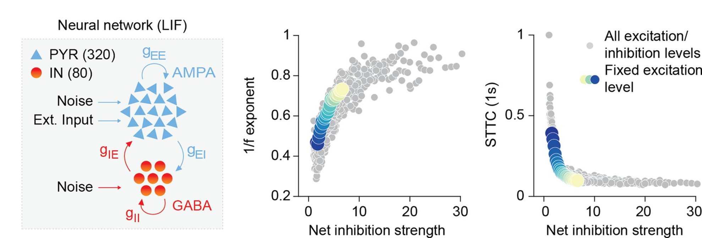

### The functional development of inhibitory circuits

One of our main interests is understanding how the heterochronicity (i.e. the diversity of timing/speed) of developmental programs is involved in the pathophysiology of psychiatric
disorders. In particular, we are interested in how it impacts inhibitory circuits, focusing particularly on parvalbumin-expressing (PV) interneurons, which we 
believe to be especially susceptible due to their prolonged and activity-dependent maturation process. 

Previous research from our team and others demonstrated that PV disruption leads to altered developmental shift of the excitation-inhibition (E-I) ratio towards inhibition. 
In turn, this impairs the decorrelation of brain activity, and compromises the emergence of rhythmic phenomena such as gamma oscillations and hippocampal ripples. 
Ultimately, these network-level disruptions have significant implications for behavior.

  
  

    <strong>Computational model: inhibition and decorrelation</strong> 
    
      Using spiking neural networks, we show that a shift towards inhibition leads to an increase in 1/f ratio (our preferred proxy), a decorrelation of spiking activity and the 
	  emergence of hippocampal ripples (see Pochinok et al., 2024). All these predictions were experimentally confirmed. 
      <a href="https://elifesciences.org/articles/78811" target="_blank">Chini et al., 2022</a>
    
  

Our ultimate goal is to establish clear links between genetic mutations and altered developmental programs on the one hand, and circuit-level dysfunction, network dynamics, and behavioral phenotypes on the other. 
By elucidating these connections in mouse models of neurodevelopmental disorders, we aim to identify translational biomarkers that can inform early diagnosis and targeted interventions in neurodevelopmental disorders.

To achieve these objectives, our lab integrates a diverse set of cutting-edge techniques. These include acute and chronic in vivo electrophysiology, optogenetic and chemogenetic manipulations, 
and detailed morphological and immunohistochemical analyses. We also employ spiking neural network modeling and comprehensive behavioral assessments to bridge our findings from genes and molecular pathways to complex cognitive behaviors. 

---

### Intrinsic Timescales as a window into neural networks

A central challenge in neuroscience is understanding how neural circuits support diverse cognitive and behavioral processes. 
One emerging way to investigate how these levels are connected is by examining intrinsic neural timescales (ITs), defined as the decay rate of the autocorrelation of neural activity.
ITs vary considerably across different brain regions, reflecting distinct computational roles: sensory areas typically exhibit short ITs suited for rapid processing, 
whereas higher-order cortical regions display longer ITs, aligning with their role in sustained cognitive functions such as decision-making and memory.

Our lab aims to leverage ITs to reverse-engineer key properties of neural circuits. Despite growing interest, the specific molecular and circuit-level mechanisms driving IT heterogeneity remain largely unknown. 
Factors such as the composition of glutamate receptors, interneuron diversity, and network connectivity have all been suggested to influence IT values and variability, yet their exact contributions are not fully understood. 
Our research seeks to address this gap by examining ITs through the lens of neural development, a natural setting in which many of these properties evolve in physiological conditions, 
providing unique insights without requiring artificial experimental manipulations.

By combining experimental and computational methodologies, we aim not only to uncover the developmental logic governing IT maturation but also to establish ITs as powerful biomarkers capable of informing 
the underlying architecture of neural circuits.

---

### Nature vs nurture in shaping brain development

Our lab investigates the fundamental question of how innate neural architecture (nature) and sensory-driven experience (nurture) jointly shape brain circuits and behaviors from early life stages. 
Central to this research is the longstanding question on whether neural networks and behaviors emerge gradually through interactions with the environment, 
or if they are instead largely preconfigured by genetic and developmental programs prior to sensory experience.

At the behavioral level, we focus on innate survival-relevant behaviors, such as light avoidance and ultrasonic vocalizations, to understand whether higher-order cortical areas like the prefrontal cortex 
actively participate in their regulation from birth, despite previous assumptions of delayed maturation. Our research reveals that these cortical regions play an unexpectedly early and active role, 
directly influencing innate behaviors long before sensory systems are fully mature.

At the cellular and network level, we investigate whether the patterns of neuronal activity, synaptic distributions, and connectivity are established independently of sensory input or require experience-driven refinement. 
Using large-scale electrophysiological recordings and computational modeling, we explore how neuronal firing rates and synaptic properties develop and maintain specific organizational features, such as heavy-tailed distributions, 
and whether these features are altered significantly by sensory experiences during critical developmental periods.

---

### CONceptual CONsistency in electroPHYSiology (CON²PHYS)

Last but not least, our lab is deeply interested in addressing conceptual fragmentation in systems neuroscience; a subtle yet critical challenge often overlooked in reproducibility discussions. 
While technical and methodological rigor has received substantial attention, we argue that reproducibility fundamentally begins at the conceptual level. 
Core concepts such as “dimensionality”, “functional connectivity” etc. are central to neuroscience, but suffer from inconsistent interpretations across labs, methods, and research groups. 
This lack of conceptual consensus can have sneaky consequences, because nominally identical concepts can be implemented in wildly different manners that are 
nonetheless all acceptable (i.e., "defensible" from a peer-review perspective). This can obscure (or amplify!) scientific disagreements around these murky concepts and, 
ultimately, slow scientific progress.

To bring this issue into light, we initiated CON²PHYS, a meta-science project explicitly designed to measure and quantify conceptual variability within the neuroscience community. 
Participants at all career stages will be invited to independently analyze a common, carefully curated electrophysiological dataset, responding to multiple-choice questions designed to test the extent to which 
they agree on how to interpret and implement various core system-neuroscience concepts. 

The ultimate objective of CON²PHYS is not only diagnostic but also actionable. By identifying where conceptual inconsistencies most significantly impact research outcomes, 
we can focus community-driven consensus-building efforts precisely where they're needed.
