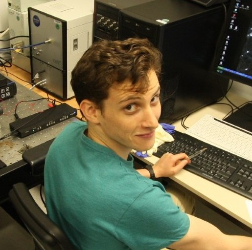

  
  <h3 style="margin:4px 0; font-size: 1.3rem;">Mattia Chini</h3>
  
Group Leader

  

    <a href="mailto:chinmattia@gmail.com"><i class="fas fa-envelope"></i></a>
    <a href="https://scholar.google.com/citations?user=tQ8lYxgAAAAJ&hl=en"><i class="ai ai-google-scholar"></i></a>
    <a href="https://gin.g-node.org/mchini"><i class="fas fa-database"></i></a>
    <a href="https://github.com/mchini"><i class="fab fa-github"></i></a>
    <a href="https://bsky.app/profile/mattiachini.bsky.social"><i class="fas fa-cloud"></i></a>
    <a href="https://www.linkedin.com/in/mattia-chini-4b490b227/"><i class="fab fa-linkedin-in"></i></a>
  

  

    
    <h3 style="margin:4px 0; font-size:1rem;">Mercedes Hildebrandt</h3>
    
Postdoc

  

  

    
    <h3 style="margin:4px 0; font-size:1rem;">Davide Warm</h3>
    
Postdoc

  

  

    
    <h3 style="margin:4px 0; font-size:1rem;">Guoming Tony Man</h3>
    
PhD Student

  

  

    
    <h3 style="margin:4px 0; font-size:1rem;">Henrik Østby</h3>
    
PhD Student

  

  

    
    <h3 style="margin:4px 0; font-size:1rem;">Irina Pochinok</h3>
    
PhD Student

  

